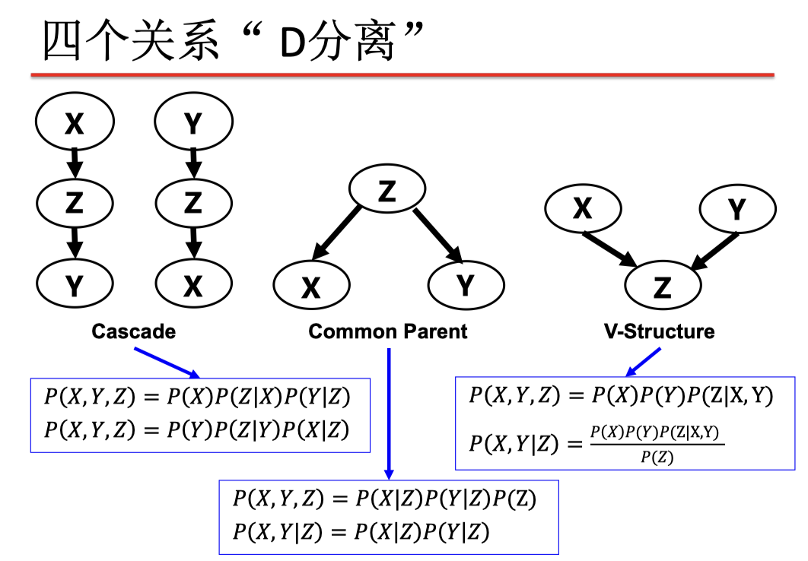

# Chapter 8 Quantifying Uncertainty

>- 对应于 "Artificial Intelligence - A Modern Approach (3rd Edition)" 中的 Chapter 6
>- QUANTIFYING UNCERTAINTY(6.1~6.6)

## 不确定性

以例为讲：

1. 局部可观察性（路况）
2. 传感器噪声（交通报告） 
3. 行动结果的不确定性（轮胎漏气等） 
4. 交通建模和预测的巨大复杂性

## 概率

概率提供了一种方法以概括因我们的惰性和无知产生的不确定性，由此解决限制问题：

- 惰性：无法枚举意外、限制等
- 无知：缺乏相关事实、初始条件等

__主观或贝叶斯（Bayesian）概率__

>概率将命题（Propositions）与自己的知识状态相关联

命题的概率随着新证据而改变: 条件概率

__不确定性与理性决策__

选择哪个行动？取决于我们对错失航班还是机场美食等的偏好

- 效用理论（Utility theory）用于 _表示和推断偏好_ 
- 决策理论 = 概率理论 + 效用理论

__概率空间或概率模型__

>略

__随机变量__

>略

## 语法和语义

### 命题基础

1. 命题为真的命题视为事件（event）（样本点集）
2. 通常在AI应用中，样本点由 __一组随机变量__ 的值定义；即， 样本空间是变量范围的笛卡尔积
3. 使用bool变量，样本点 = 命题逻辑模型：比如，A=true / B=false, 或 
4. 命题 = 原子事件在其中是正确的分离：比如，

### 命题的语法

1. 命题或布尔随机变量
2. 离散随机变量（有限or无限），值必须是详尽且互相排斥的
3. 连续随机变量（有界or无界）

## 推理

### 先验概率

def as: 命题的先验或无条件概率， 对应于任何（新）证据到达之前的信念

1. 概率分布给出所有可能分配的值，是一个向量

2. 一组随机变量的联合概率分布给出了这些随机变量上每 个原子事件（即每个样本点）的概率

3. 每个问题都可以通过联合分布来回答， 因为每个事件都是样本点的和

### 连续变量的概率

概率密度函数：将概率分布表示为值的参数化函数

其余从略

### 条件概率（后验概率）

基础知识从略，说一个新颖的：

1. 在一些情况下，新证据可能无关，因此可以简化
2. 链式法则是通过连续应用乘积规则得出的：$P(X_1,...,X_n) = \prod_{i=1}^n P(X_i|X_1,...,X_{i-1})$

概率基础：

- 边缘化：$P(x) = \Sigma_Y P(x,y=Y)$
- 链式法则：...
- 贝叶斯规则：......

### 枚举推理（Inference by enumeration）

1. 从联合概率分布开始
2. 也可以计算条件概率
3. 总体思路：通过固定证据变量并 __对隐藏变量求和__ ，来计算查询变量的分布

解释一下上述“总体思路”：

>$P(a|b) = \alpha P(a,b) = \alpha[ P(a,b,c) + P(a,b,{NOT}c) ]$

## 独立性

def as: $P(AB) = P(A)P(B)$

也可以写作：$P(A|B) = P(A)$

examples: if A与B独立

1. $P(A|B,C) = P(A|C)$
2. $P(A,B|C) = P(A,B,C)|P(C) = P(A|C)*P(B|C)$

## 贝叶斯规则

def as: $P(a|b) = [P(b|a) * P(a)] / P(b)$

独立性并不意味着有条件独立性

这张图很具有借鉴意义：

