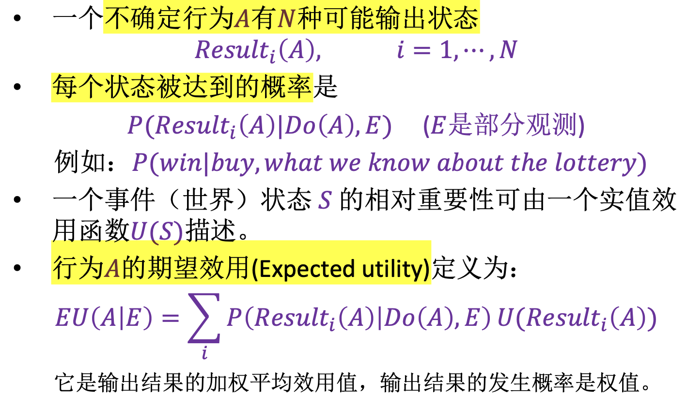
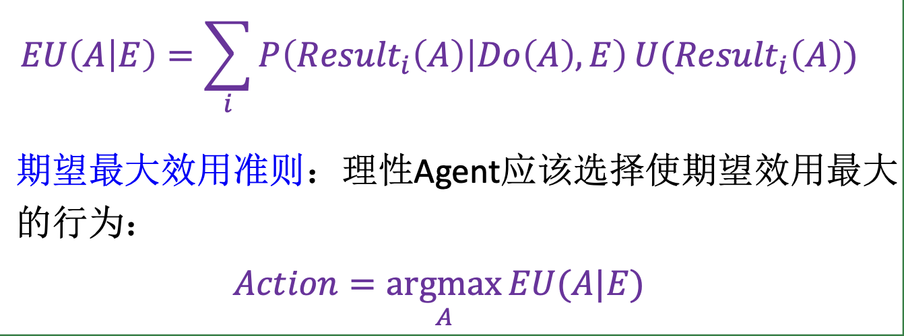
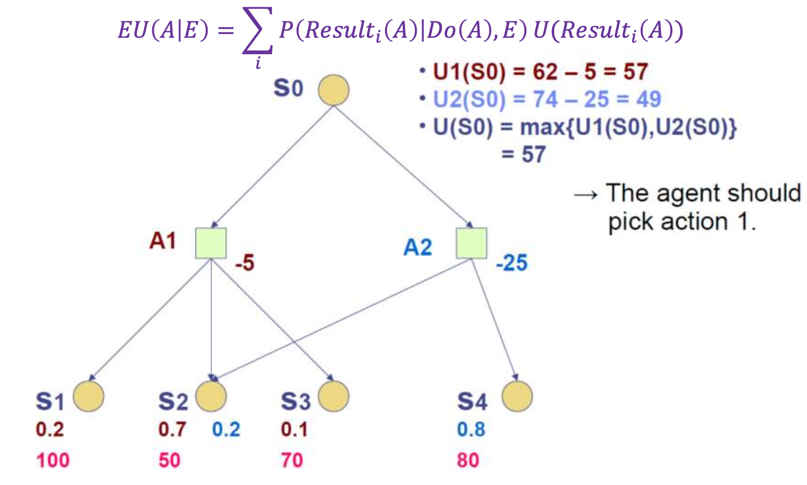
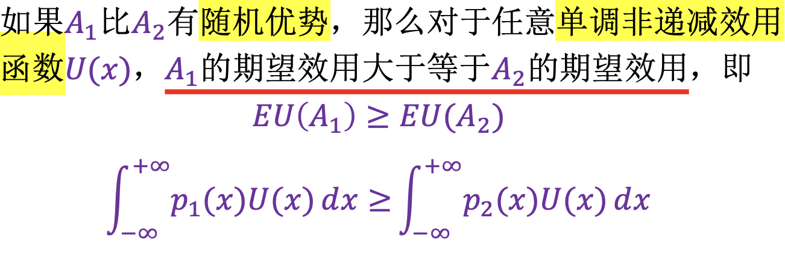

# Chapter 10 Making Simple Decisions

决策理论 = 概率理论 + 效用理论

>当且仅当它选择产生最高期望效用的行为（在行为的所有可能结果中平均）时，Agent才是理性的

## 理性决策

理性Agent应该选择能够最大化期望效用的行为𝐴：
> $Action = argmax_A{EU(A|E)}$

Agent在抽奖或状态间的偏好定义为：

ￚ 𝐴 ≻ 𝐵 Agent _偏好A甚于B_
ￚ 𝐴 ~ 𝐵 Agent对𝐴和𝐵 _偏好相同_
ￚ 𝐴 ≿ 𝐵 Agent _偏好A甚于B_ 或者 _偏好相同_

## 效用理论的公理

理性Agent的偏好必须要遵守的6个约束

1. 有序性
2. 传递性
3. 连续性: 𝐴 ≻ 𝐵 ≻ 𝐶 ⟹ ∃𝑝 𝑝, 𝐴; 1 − 𝑝, 𝐶 ~ 𝐵
4. 可替换性: 𝐴 ~ 𝐵 ⟹ [𝑝, 𝐴; 1 − 𝑝, 𝐶] ~ [𝑝, 𝐵; 1 − 𝑝, 𝐶] 把其中的 “~” 替换成 “≻” 后仍然是成立的
𝐴 ≻ 𝐵 ⟹ 𝑝, 𝐴; 1 − 𝑝, 𝐶 ≻ 𝑝, 𝐵; 1 − 𝑝, 𝐶
5. 单调性: 𝐴 ≻ 𝐵 ⟹ (𝑝 ≥ 𝑞 ⇔ 𝑝, 𝐴; 1 − 𝑝, 𝐵 ≻ 𝑞, 𝐴; 1 − 𝑞, 𝐵 )
6. 可分解性: [𝑝, 𝐴; 1 − 𝑝, 𝑞, 𝐵; 1 − 𝑞, 𝐶 ~ 𝑝, 𝐴; 1 − 𝑝 𝑞, 𝐵; 1 − 𝑝 1 − 𝑞 , 𝐶]

效用理论的公理实际上是关于偏好的公理, 没有涉及效用函数

## 效用原则

__最大化期望效用（MEU）__

任何理性Agent都存在一个效用函数，但这个效用函数不是唯一的

如果一个Agent的效用函数根据如下公式变换，它的行为将不会改变：

>𝑈′(𝑆) = 𝑎𝑈(𝑆) + 𝑏

其中𝑎和是𝑏常数，且𝑎 > 0；这是一个仿射变换

__归一化效用__

ￚ 效用“0”：“最坏的可能灾难”
ￚ 效用“1”：“最好的可能奖励”

>𝑢⊥ = 0，𝑢⊺ = 1

给定一个𝑢⊥和𝑢⊺之间的效用尺度，任何特定奖励𝑆的效用是通过让Agent在𝑆和标准抽奖𝐿𝑝 = 𝑝, 𝑢⊺; (1 − 𝑝), 𝑢⊥ 之间选择进行评估的 (类比vector基本定理)

## 多属性效用函数

### 严格优势

- 假设：更高的属性值对应更高的效用。
- 严格优势：行为𝐵比行为𝐴有严格优势，当且仅当

>∀𝑖 𝑋𝑖(𝐵) ≥ 𝑋𝑖(𝐴) (因此𝐸𝑈 𝐵 ≥ 𝐸𝑈 𝐴 )

PS: 在现实中，很少存在严格优势

### 随机优势

通常可以在没有精确分布的情况下，使用定性推理确定随机优势

Definition($x -+-> y$, x对y有积极影响)

对于𝑌的其他父母𝐙的每个值𝐳,
>∀𝑥1, 𝑥2 𝑥1≥ 𝑥2 ⇒ P(𝑌|$𝑥_1$, 𝐳) 比 P(𝑌|$𝑥_2$, 𝐳) 具有随机优势
