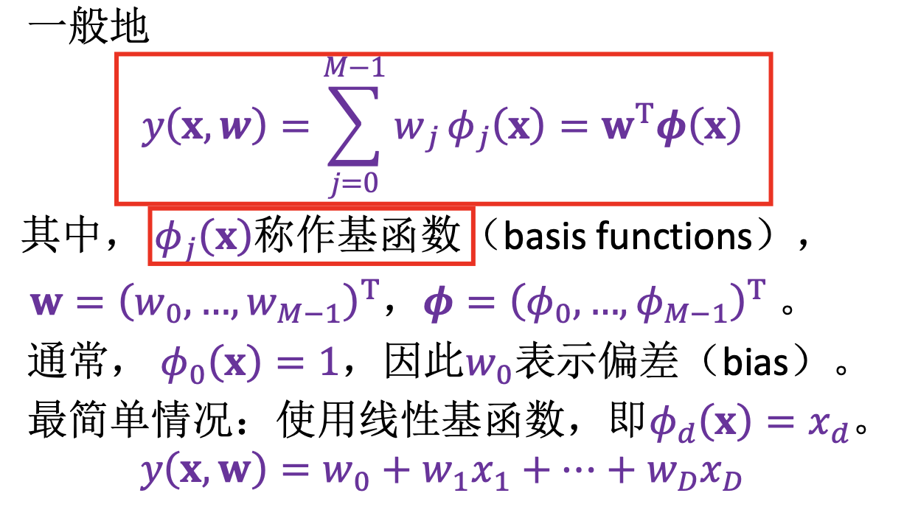
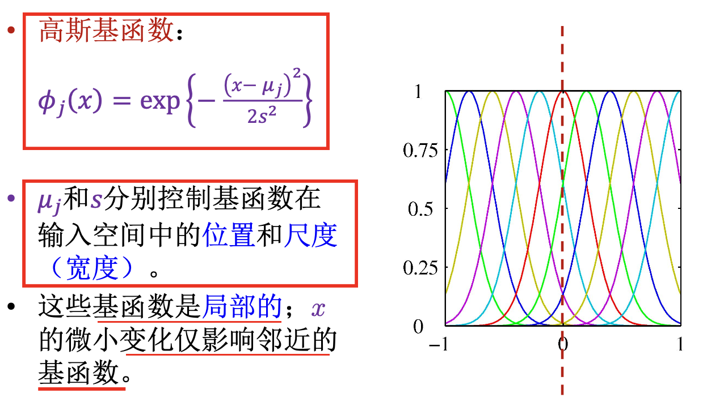
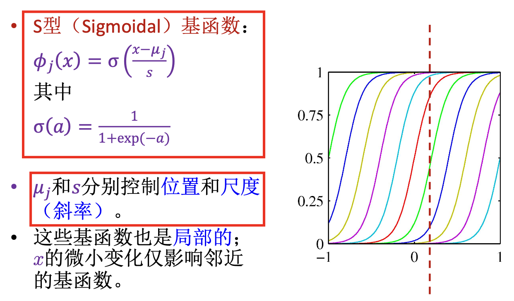
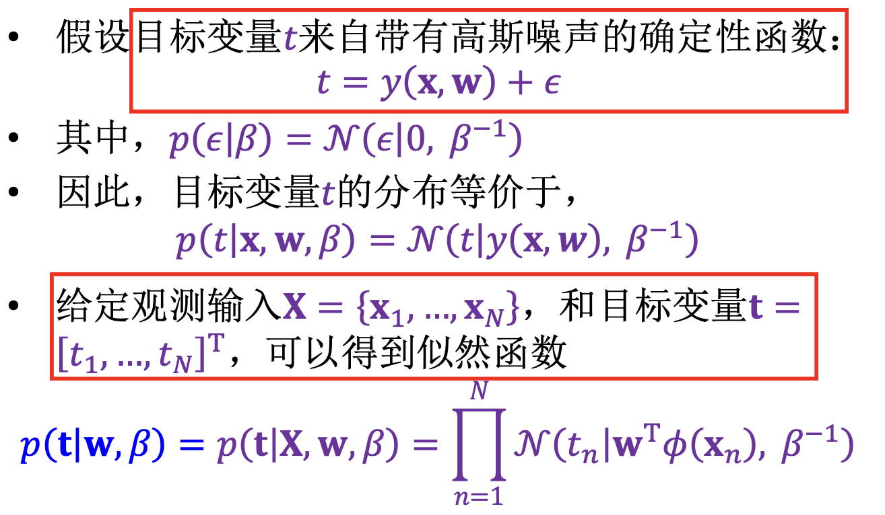
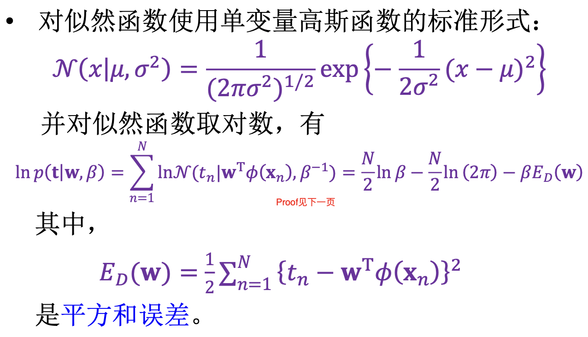
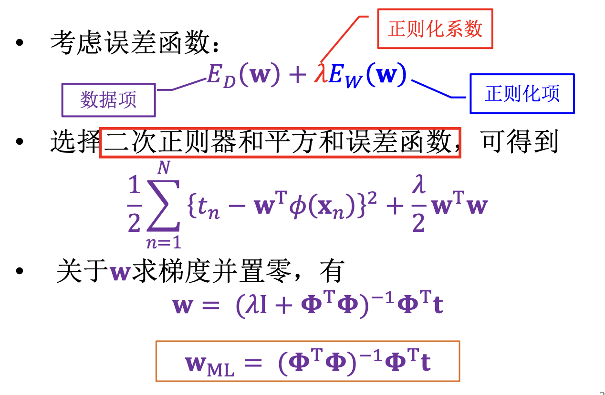
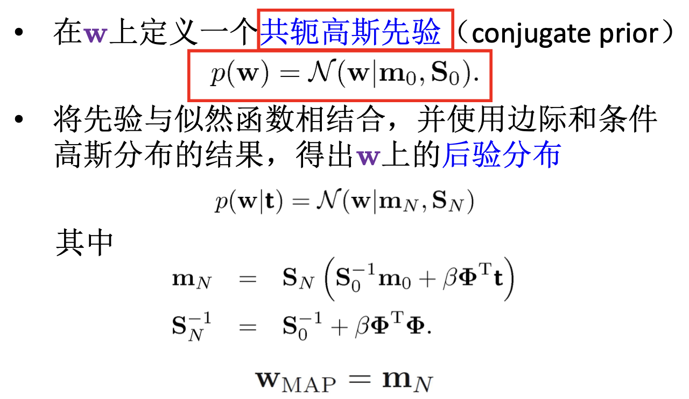
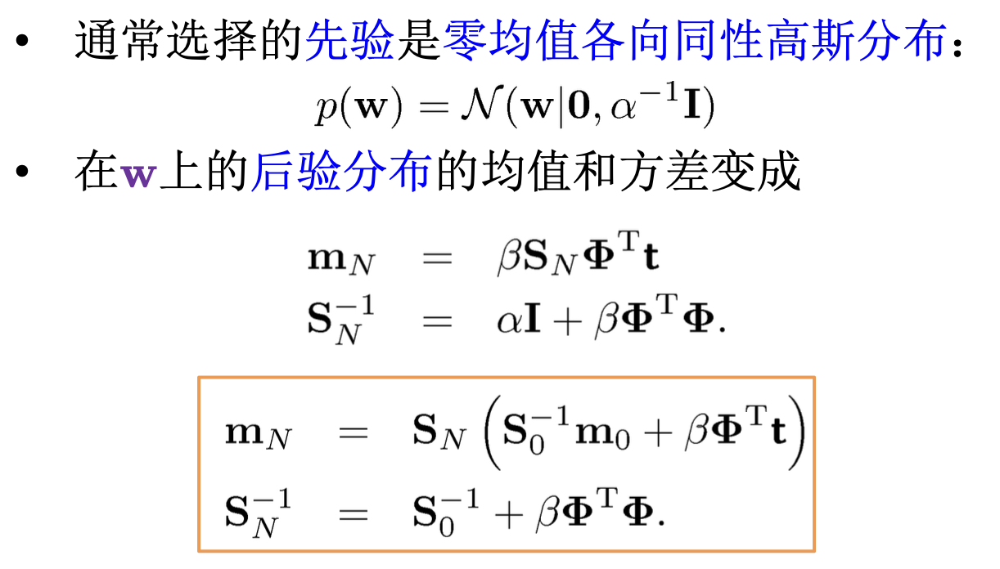
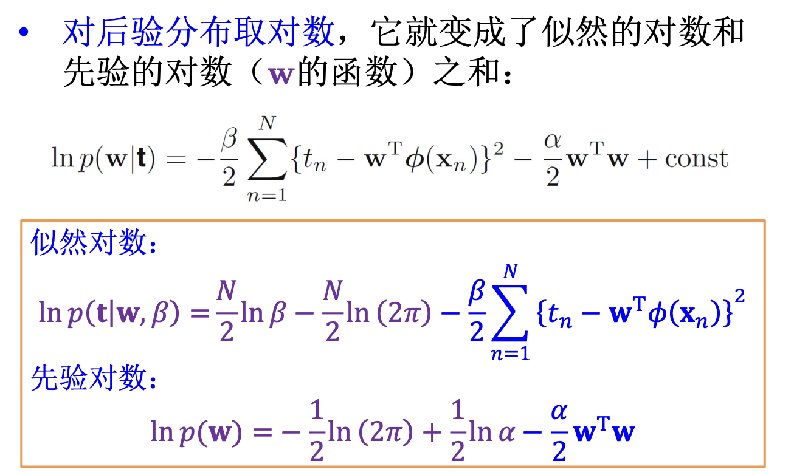
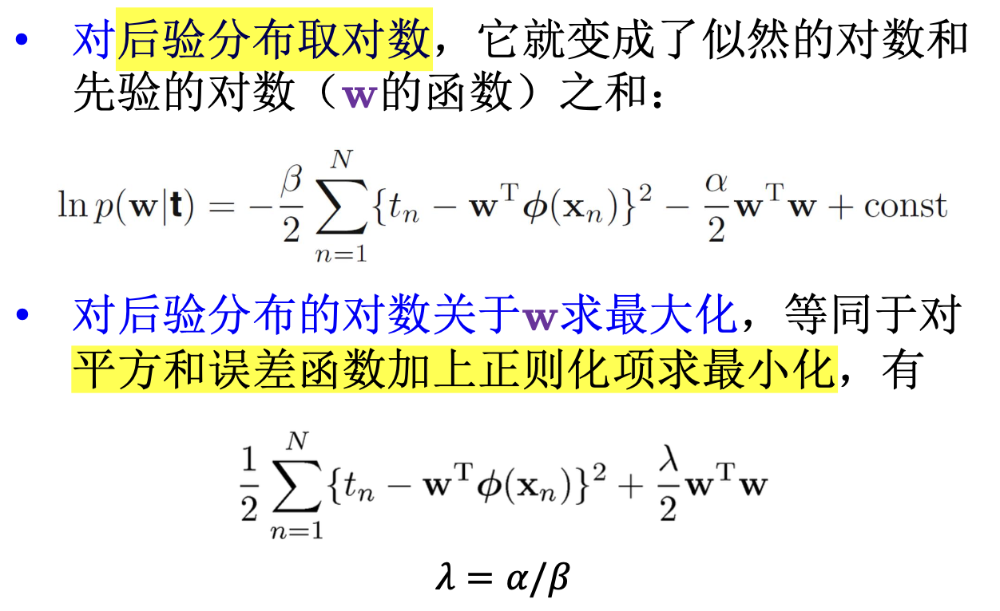

# Chapter 11 Linear Models for Regression

回归分为 __学习(等价于函数拟合)__ 和 __预测(基于拟合进行计算)__ 两个过程

线性回归模型: 使用一组固定的(非)线性函数(基函数)的组合表示回归模型

## 线性基函数模型

__损失函数__

平方和误差函数

$E(w) = 1/2*\Sigma (y(x_n,w) - t_n)$

__常见基函数选取__

## 最大似然和最小二乘

正则化最小二乘

## 贝叶斯线性回归

