# Chapter 12 Linear Models for Classfication

## 图像分类

__分类的要素__

1. 机器学习方法，例如:线性分类，深度学习 
2. 图像表征，例如:SIFT，HoG，深度特征
3. 数据，例如:PASCAL，ImageNet，COCO Objects-365

__步骤__

- 收集带有标签的图像数据集
- 使用机器学习方法训练图像分类器 
- 在测试图像上评测学到的分类器

__函数使用__

ㅡ 评分函数 (Scorefunction): 原始数据到类别分数
ㅡ 损失函数 (Lossfunction): 预测分数与真值标签之间的一致性

__线性分类器__

>寻找一个线性函数(超平面)以分离开正 样本(红色)和负样本(蓝色)

## 广义线性模型

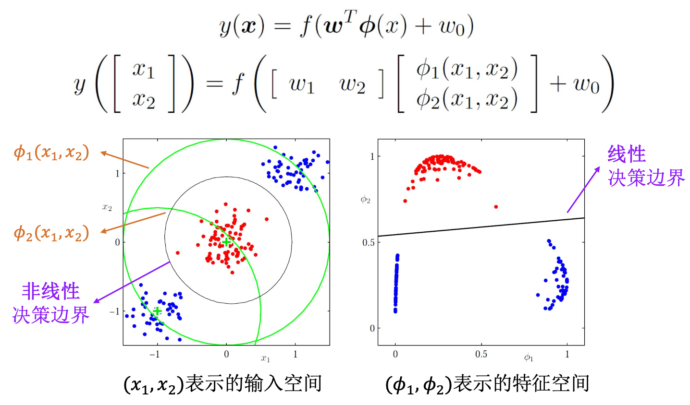

## 判别函数 (DiscriminantFunctions)

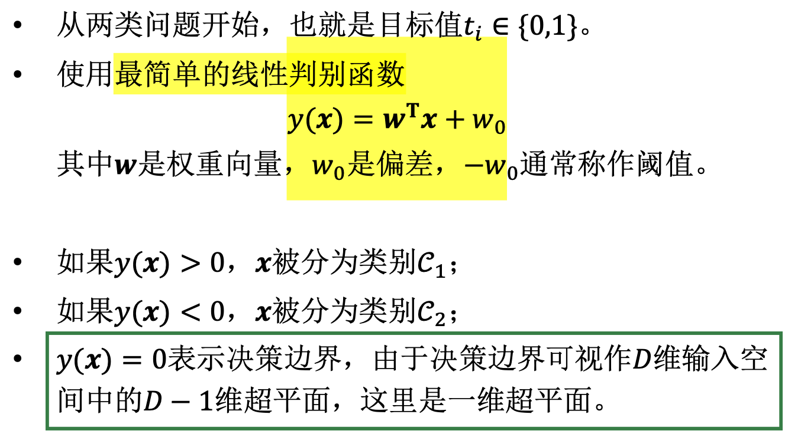

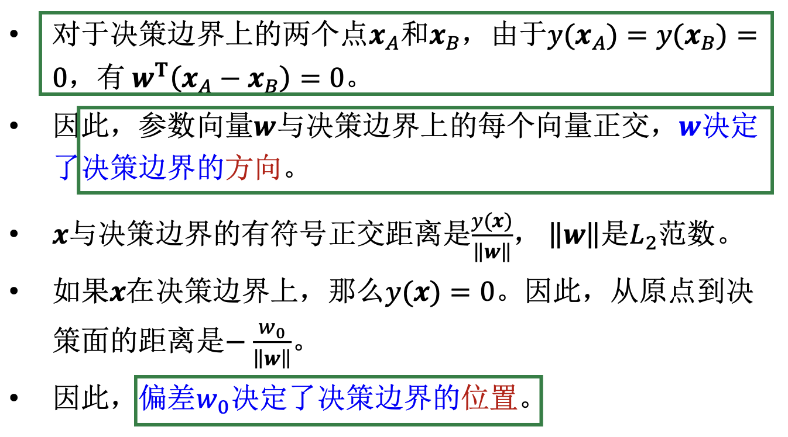

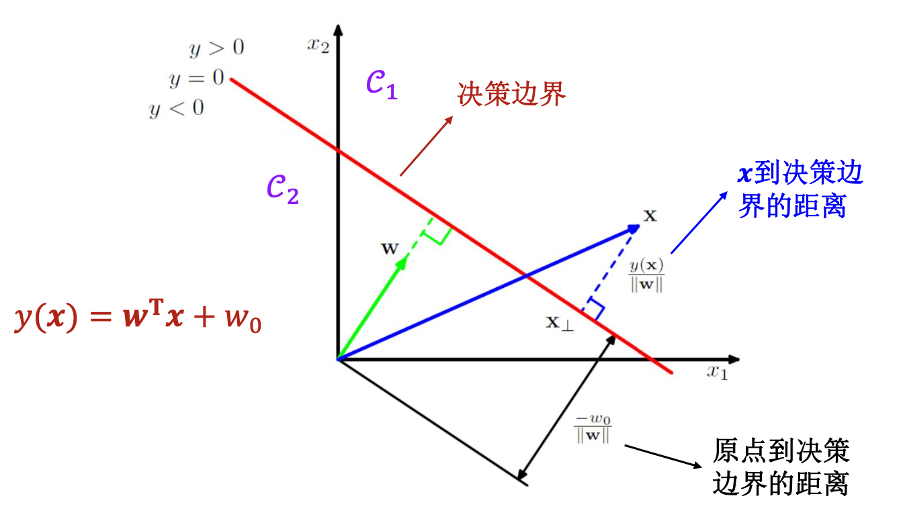

## 多类分类

- One versus the rest: 在C_k类与其他类构建(k-1)个分类器
- One versus one: 在所有类别之间构建(k(k-1)/2)个分类器

__最小二乘的问题__

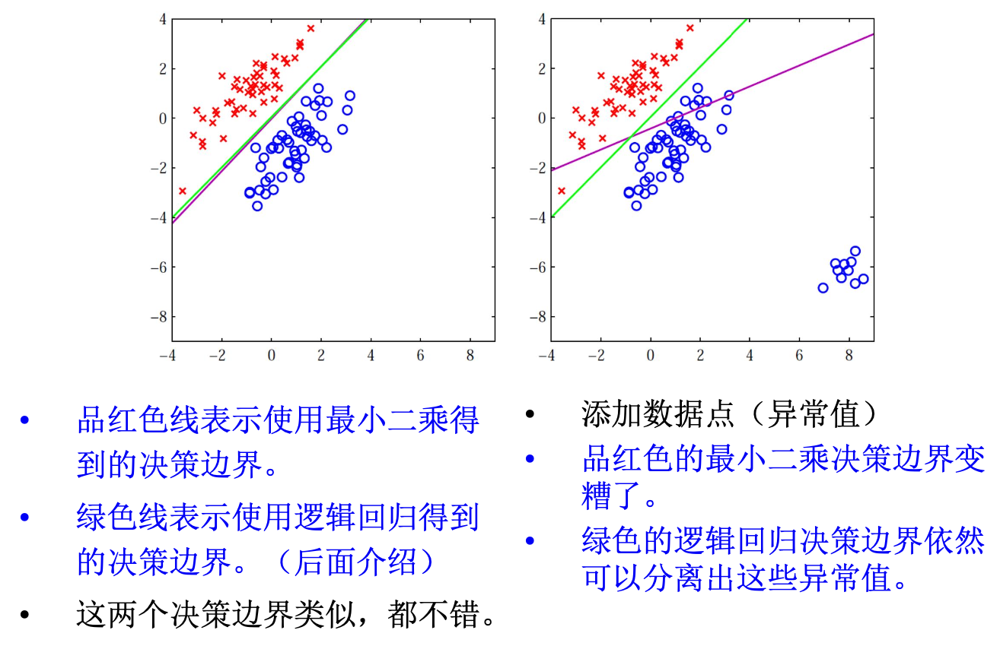

## Fisher线性判别

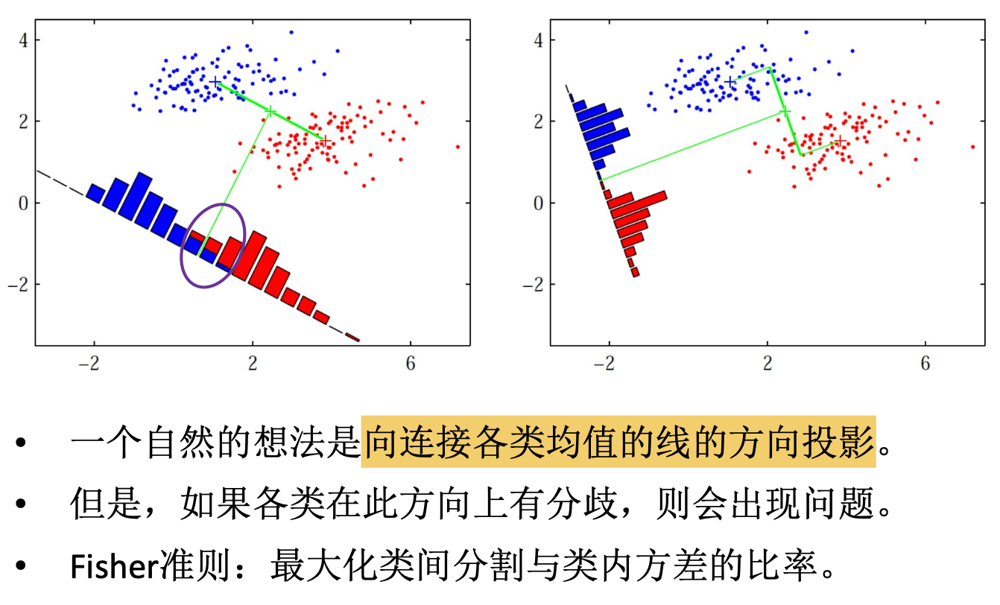
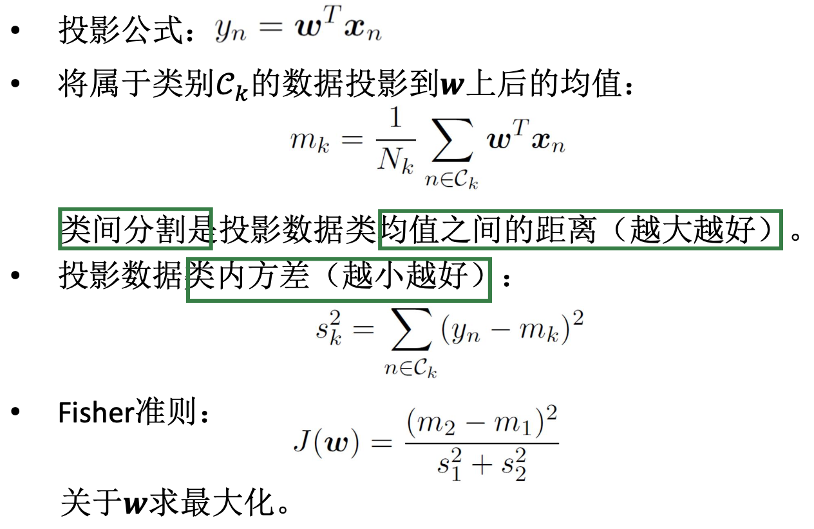

1. Fisher线性判别是一种维数降低技术，因为投影是将多维的数据点转换为一维空间中的目标值
2. Fisher线性判别是一种基于类标签选择投影的准则, 仍然受到异常值的影响 (例如，最小二乘示例)

## 感知机

感知机对应于输入空间(特征空间)中将数据点划分为正负两类的分离超平面，属于判别模型

感知机学习旨在求出将训练数据进行线性划分的分类超平面

通过导入基于误分类的损失函数，利用梯度下降法对 损失函数进行极小化，求得感知机模型

### 损失函数

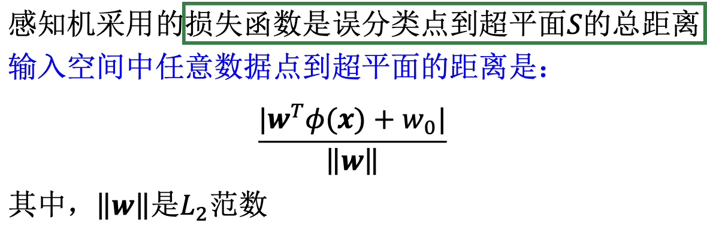

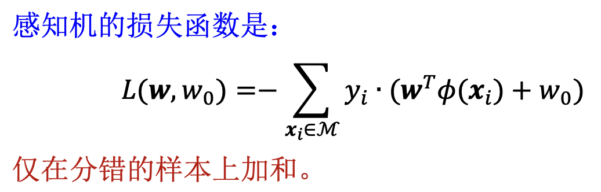

### 感知机学习策略

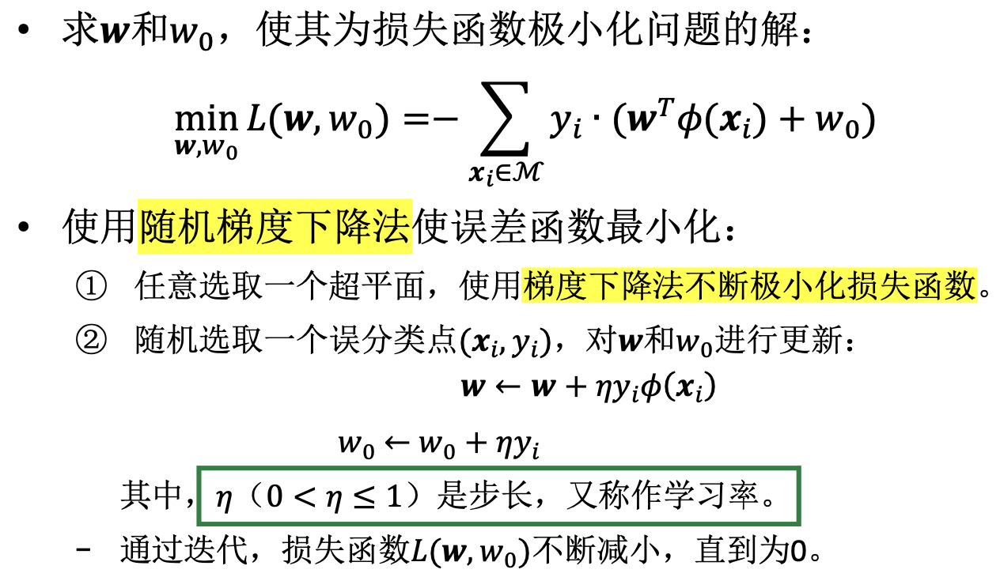

## 生成模型 (GenerativeModels)

### 概率生成模型

本质上是概率改写，很简单...

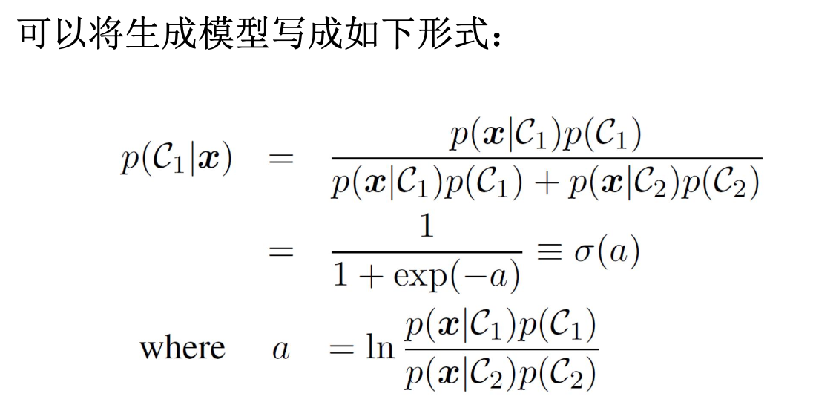

>review: Logistic Sigmoid
>$\sigma(a) = 1/(1+e^{(-a)})$

### 最大似然学习 – 类先验

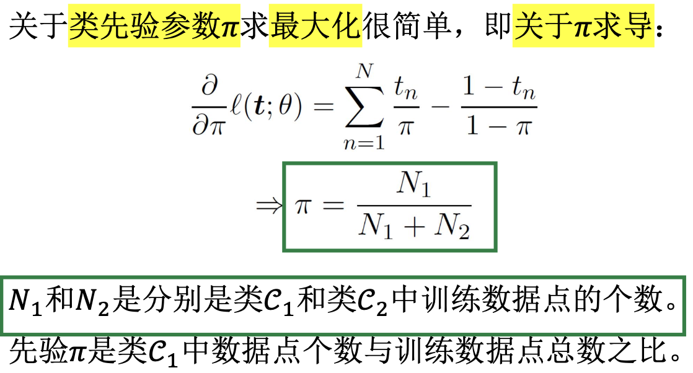

## 判别模型 (DiscriminativeModels)

### 概率判别模型

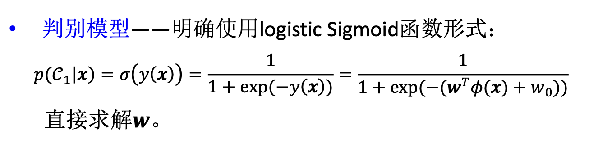

### 最大似然学习 – 判别模型

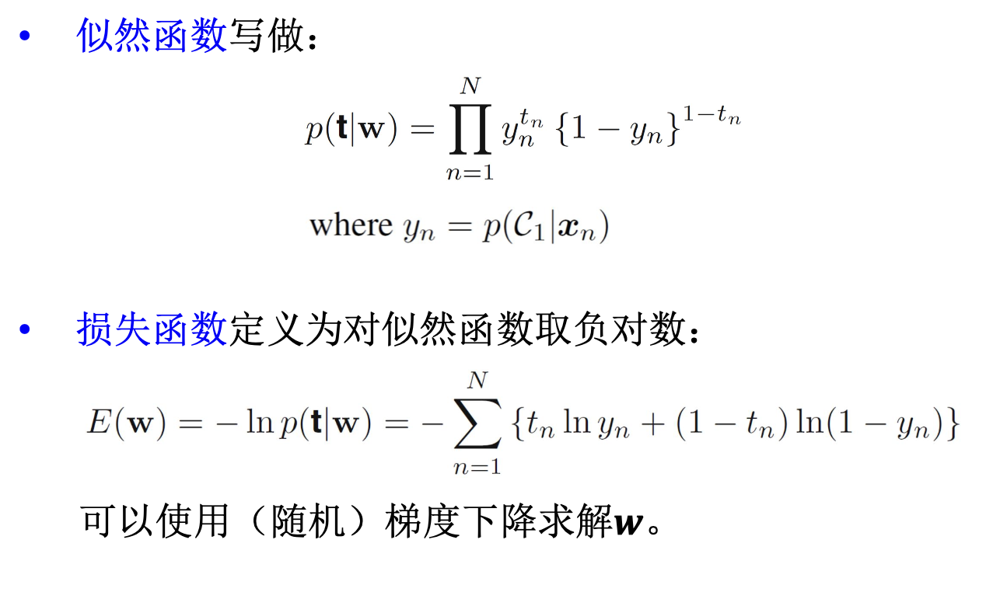

