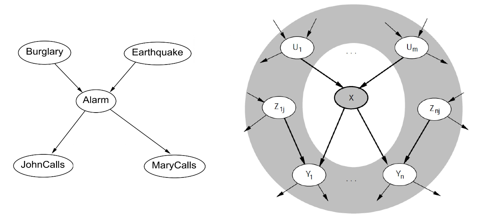

# Chapter 9 Probabilistic Reasoning

## 贝叶斯网络 (Bayesian networks)

贝叶斯网络: 一种简单的图表示法，用于表示变量之间的依赖关系，因此可用于紧凑地指定完全联合分布

贝叶斯网络的语义：

- 第一种：是将贝叶斯网络看做对联合概率分 布的表示，这样可以帮助我们理解如何构造网络
- 第二种：将贝叶斯网络看做是对一组条件依 赖性语句的编码，这样可以帮助我们设计推理过程

二者等价！

## 构建Bayesian Networks

- 全局语义(数值语义): 给定父结点，一个结点条件独立于它的其它祖先结点
- 局部语义(拓扑语义): 给定父结点，每个变量条件独立于它的非后代结点

Theorem1: 
>全局语义和局部语义等价

Theorem2:
>给定马尔可夫覆盖(Markov blanket ):一个结点的父结点、子结点以及子结点的父结点，这个结点条件独立于 所有其它结点

## 贝叶斯网络中的精确推理

### 基础概念

### 枚举推理

### 变量消元法

感觉就是运算技巧，没啥用，略 🤣

## 贝叶斯网络中的近似推理

ㅡ 直接采样: 从空网络采样
ㅡ 拒绝采样: 拒绝与证据不一致的样本 
ㅡ 似然加权: 使用证据对样本加权
ㅡ 马尔可夫链蒙特卡洛(MCMC): 从一个随机过程采样，其平稳分布是真实的后验

### 直接采样 (从空网络采样)

>按照拓扑结构的顺序对每个变量进行采样，变量值被采样的概率分布依赖于父结点已得到的赋值

### 拒绝采样 (Rejection sampling)

### 似然加权 (Likelihood weighting)

>固定证据变量，仅对非证据变量进行采样，并根 据其与证据吻合的似然(相似性)对每个样本进行加权

似然加权返回一致估计，然而当证据变量的个数增 加时它的性能仍然会大幅度下降。因为大多数样本的权值都非常小，从而加权估计中起主导作用的是那些所占比例很小的、与证据相符合的似然程度不是非常小的样本

### 使用MCMC近似推理

思想: 给定网络的状态 (当前所有变量的取值)，通过采样一个变量生成下一个状态

Theorem
>马尔科夫链趋于稳态分布 (Stationary distribution)， 在每种状态下花费的时间的长期比例正好与其后验概率 成正比

